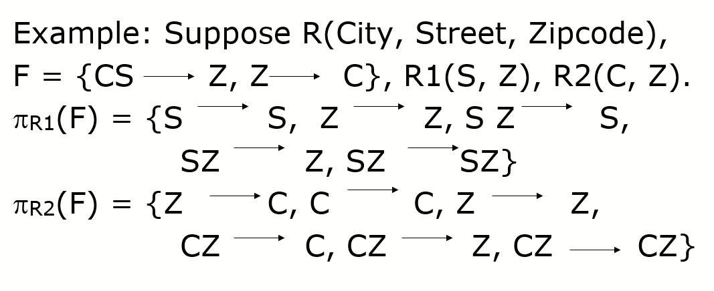
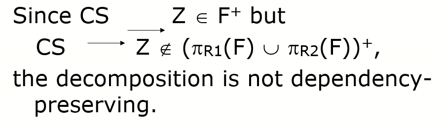

# Functional-Dependency

## Finding Candidate Keys from FDs   

### Method1:暴力穷举

对于关系模式`R(A1, ..., An)`,穷举属性组合`AiAj..Ac`，`c`取值从`1-n`

* 如果`AiAj..Ac`存在子集是候选码，则`AiAj..Ac`不是候选码
* 计算`AiAj..Ac`的闭包，如果等于`A1A2...An`，则`AiAj..Ac` 是候选码

### Method2:图方法

#### Step1

> 将函数依赖关系通过图形式表现

#### Step2

>  找出所有**入度为0**的属性，命名为`Vni`
>
> * 入度为0表示通过其他属性无法获取该属性
> * 候选码需要包含`Vni`
> * 如果`Vni`是候选码，那么`Vni`是唯一候选码

#### Step3

> 找出所有**出度为0,入度大于0**的属性，命名为`Voi`
>
> * 这些属性可以由其他属性推出，本身却无法推出其他属性
> * 候选码**不包含**`Voi`

#### Step4

> 通过上述确定候选码范围，通过观察法查找

### Method3:快速确定法

首先对于给定的`R(U)`和函数依赖集`F`,可以将它的属性划分为4类

* L类,仅出现在F的函数依赖**左部**的属性
  * 也就是**入度为0**，别人无法决定它
  * L类必是**任意**候选码的子集，如果`L闭包`包含所有属性，则`L`是**唯一候选码**

* R类,仅出现在F的函数依赖**右部**的属性
  * 出度为0，入度不为0，无法决定其他属性，而其他属性可决定它
  *   **R不在任何候选码中**
*  N类,在F的函数依赖左部和右部均未出现的属性  
  * 孤立属性，N**必是**任意候选码的子集
  * `LN`的闭包如果包含`R`的全部属性，则`LN`是唯一候选码
* LR类,在F的函数依赖左部和右部两部均出现的属性
  * 视情况

## Relation Decomposition(关系分解)

### 概述

> R是一个关系模式，`R = R1 U R2 U R3 U R4 U...Rn`，则`{R1,R2,R3,R4,...Rn}`是`R`的一个关系分解 

* r是关系模式R的一个实例，由于关系分解的原因r的数据可能丢失

### Lossless Join Decomposition(无损连接)

当一个关系模式分解成若干个关系模式后，再连接，没有出现数据丢失
$$
r = \pi R1(r)\infty \pi R2(r)\infty \pi R3(r) ...\infty \pi R4(r)
$$

#### 无损连接条件-分解成两部分

$$
R1 \bigcap R2 \to R1-R2\space\space\space or \space\space\space R1 \bigcap R2 \to R2-R1
$$

#### 判定无损连接性的算法-通用

##### 输入

* 关系模式`R(A1,A2,..An)`
* 函数依赖`F`
* 分解`P = {R1,R2,...Rk}`

##### 方法

* 构造一个**k行n列**的表，第`i`行对应于关系模式`Ri`，第`j`列对应于属性`Aj`。**如果Aj∈Ri，则在第`i`行第`j`列上放符号`aj`,否则放符号`bij`**
* 逐一检查F中的每一个函数依赖，并修改表中的元素。
  * 取F中一个函数依赖`X→Y`，在**X**的**列**中**寻找相同的行**，然后将这些**行中Y的分量改为相同的符号**，**如果其中有`aj`,则将`bij`改为`aj`;若其中无`aj`，则改为某一个`bij`**

* 反复检查第（2）步，至无改变为止，若存在某一行为a1,a2,…,ak,则分解 具有无损连接性
  * 如果F中所有函数依赖都不能再修改表中的内容，且没有发现这样的行，则分解P不具有无损连接性

###  Dependency-Preserving Decomposition(依赖保持分解)

关系模式`R`及R上的某个函数依赖集合`F`，对于R上的子集`R0`，`F0`在满足下列关系的情况下，称为`F`在`R0`上的一个投影
$$
F0 = \pi_{R0}(F) = 
\{X \to Y\space\space|\space\space F\space|=X\to Y and\space XY \subseteq R0 \}
$$

> **F在R0上的投影，实际上就是找出R0上全部符合要求的函数依赖关系**
> $$
> \pi_{R0}(F) = \pi_{R0}(F^+)
> $$
> 

#### 依赖保持

> 给定关系模式`R`，和函数依赖集`F`，对于R的分解`{R1,R2,...Rn}`，依赖保持需满足：
> $$
> F^+ = (F_{1} \bigcup F_{2}...\bigcup F_{n})^+
> $$
>
> $$
> F_{i} = \pi_{Ri}(F),i=1,2..,n
> $$
>
> 

#### 证明依赖保持：对于两个分解

#### 证明依赖保持：对于多个分解

> 遍历所有在`F`中的`X→Y`
>
> * 如果存在某个`Ri`包含`XY`，则`X→Y`是依赖保持的
> * 否则运用`XYGP`算法寻找`W`
>   * 如果`Y`是`W`子集，则`X→Y`是依赖保持的
>
> 对于所有的`X→Y`都是依赖保持的，则`{R1,R2,...Rn}`是依赖保持分解

**XYGP算法**

W:= X （初始化W为X）

重复下述运算n次：
$$
W := W \cup ((W \cap R_{i})^+\cap R_{i})
$$
直到W不再改变