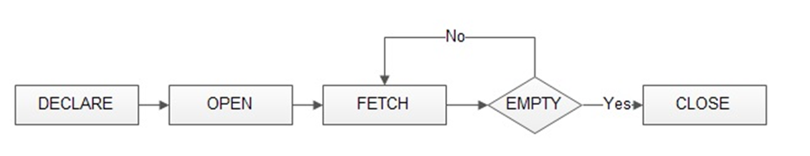
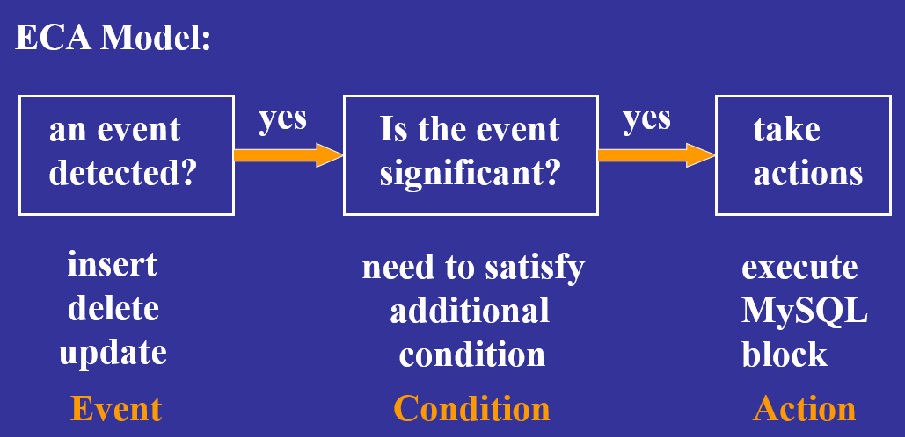

# 目录

[TOC]


# MySQL Executable Objects 

## 概述

### 可执行对象类别

#### Stored functions(存储函数)

返回计算结果，可用于SQL中的表达式

**具有返回值**

#### Stored procedures(存储过程）

用于执行任务计算

#### Triggers(触发器)

当某些表更改其内容时，可以自动执行它们

#### Events(事件)

他们的执行是按时间表进行的。


### 一个简单的存储过程

```mysql
create procedure GetAllEmployees()
begin
	select * from employees;
end;

# calling Stored Procedure
call GetAllEmployees();
```


---


## Variables(变量)

### 变量声明

#### 变量声明语法

**`declare variable_name datatype [default default_value];`**

*  `variable_name`变量名
* `datatype` 数据类型

* `default default_value` 默认值

##### Example

```mysql
declare total_sale int default 0;	# 设置默认值
declare x,y int;	# 逗号分隔声明多个变量
```


### 变量赋值

#### set赋值

```mysql
declare total_count int;
set total_count = 10;
```

#### select赋值

```mysql
declare total_counts int;
select count(*) into total_counts from employees;
```

> 通过`into`将查找结果注入变量


### 变量生存域

#### 定义在stored procedure中

* **到达存储过程的end语句时，该变量将超出范围失效**

#### 定义在begin-end块

* **只能在begin-end块中起作用**

#### `@` 标记的变量

* **在会话结束之前有效**

* 会话即是一个线程，MySQL是单进程多线程的系统


### `@variable`  session variables(会话变量)

### 初始化会话变量

#### set初始化

```mysql
set @x = 1;
```

#### select 初始化

```mysql
select @x;
```


### Example

```mysql
create procedure prc_test()
begin
	declare var2 int default 1;
	set va2 := var2 + 1;
	set @var2 := @var2 + 1;
	select var2,@var2;
end;
```

#### 初始化`@var2`

```mysql
set @var2 = 1;
```

#### 执行结果

* `var2`的生存域是`begin-end`
* `@var2` 存活于**整个会话**，所以会保存中间计算结果

```text
mysql > call prc_test();
		output:
			var2	@var2 
			-----	-------- 
			  2	    2
			  
mysql > call prc_test();
			var2	@var2 
			-----	-------- 
			  2	    3
			  
mysql > call prc_test();
			var2	@var2 
			-----	-------- 
			  2	    4
```


---


## Parameter Modes(参数模式)

### 概述

#### IN：默认模式

* **调用函数必须向每一个in传递参数**

#### OUT

* **在存储过程中可修改**
* **最终计算结果会传回调用程序**

#### INOUT

* **结合`IN` `OUT`的特性**


### IN用法

#### 返回在`deptname`的学生数量

> 利用`select`进行返回，只需要传入必要的`in`参数

```mysql
create procedure GetStudentSizeByDept(in deptname varchar(50))
begin
	select count(*) from Students
	where dept_name = deptname;
end;

# 调用
call GetStudentSizeByDept(‘CS’);
```


### OUT用法

**`OUT`中传入一个会话变量，接收计算结果**

```mysql
create procedure GetStudentSizeByDept1(in deptname varchar(50), out num_of_students int)
begin
	select count(*) into num_of_students
	from Students
	where dept_name = deptname;
end;

# 调用，传入一个会话变量
call GetStudentSizeByDept1(‘CS’, @num_of_students);
# select获取
select @num_of_students;
```


### 结合Function返回

**创建一个存储函数，返回计算结果**

```mysql
create function GetStudentSizeByDept2(in deptname varchar(50)) returns int
begin
	declare num_of_students int;
	select count(*) into num_of_students from Students
	where dept_name = deptname;
	return (num_of_students);
end;

# 调用，select取出返回值
select GetStudentSizeByDept2(‘CS’);
```

**也可不必定义一个变量，直接返回就可，如果代码短的话**

```mysql
create function GetStudentSizeByDept2(in deptname varchar(50)) returns int
begin
	return (select count(*) from Students
           	where dept_name = deptname);
end;
```


---


## 语法结构

### IF

```text
IF if_expression THEN commands
[ELSEIF elseif_expression THEN commands]
[ELSE commands]
END IF;
```

**expression：**执行条件

**commands：**执行语句

#### Example

> 获取用户等级

```mysql
create procedure GetCustomerLevel(in p_customerNumber int(11),
                                  out p_customerLevel  varchar(10))
begin
	declare creditlim double;
	select creditlimit into creditlim from customers 
	where customerNumber = p_customerNumber;
	if creditlim > 50000 then
		set p_customerLevel = 'PLATINUM';
	elseif (creditlim <= 50000 and creditlim >= 10000) then
		set p_customerLevel = 'GOLD';
	elseif creditlim < 10000 then
		set p_customerLevel = 'SILVER';
	end if;
end;
```


### Case Statement

```text
CASE case_expression
	WHEN when_expression_1 THEN
		commands
   	WHEN when_expression_2 THEN  
    	commands
	...
	ELSE commands
END CASE;
```

**case_expression：**执行变量

**when_expression_1：**执行条件

**commands：**执行语句

#### Example

> 获取航运时间

```mysql
create procedure GetCustomerShipping(in p_customerNumber int(11),
                                     out p_shiping varchar(50))
begin
	# 获取用户城市
	declare customerCountry varchar(50);
	select country into customerCountry from customers
	where customerNumber = p_customerNumber;
	# 分类
	CASE customerCountry
		WHEN 'USA' THEN
			set p_shiping = '2-day Shipping';
		WHEN 'Canada' THEN
			set p_shiping = '3-day Shipping';
		ELSE
			set p_shiping = '5-day Shipping';
		END CASE;
end;
```


###  Loop Statements

#### While Loop

```mysq
WHILE expression DO
	Statements
END WHILE;
```

**expression：**执行条件

**Statements：**执行语句


#### Example of While Loop

> 连接累加结果

```mysql
create procedure WhileLoopProc()
begin
	declare x int;
	declare str varchar(255);
	set x = 1;
	set str = '';
    WHILE x <= 5 DO
        set str = concat(str, x, ',');
        set  x = x + 1; 
    END WHILE;
    # 获取结果
    select str;
end;

# 调用
call WhileLoopProc();
```

输出

```text
1,2,3,4,5
```


#### Repeat Loop

```mysql
REPEAT
    Statements;
    UNTIL expression
END REPEAT;
```

**Statements：**执行语句

**expression：**终止条件


#### Example of Repeat Loop

```mysql
REPEAT 
	set str = concat(str, x, ',');  
	set  x = x + 1; 
	UNTIL x > 5      -- no semicolon here 
END REPEAT;
```


### Loop & Leave & Iterate

#### LEAVE

**等价于JAVA中的`break`**

#### ITERATE

**等价于JAVA中的`continue`**


#### Example

```mysql
create procedure LOOPLoopProc()
begin
	declare x int;
	declare str VARCHAR(255);
    set x = 1;
    set str = '';
    loop_label: LOOP
    	# 循环终止条件
        IF x > 10 THEN
            LEAVE loop_label;
        END IF;
        set  x = x + 1;
        IF (x mod 2) THEN
            ITERATE  loop_label;
        ELSE
            set str = concat(str, x, ',');
        END IF;
    END LOOP;    
    select str;
end;
```

output

```text
2,4,6,8,10,
```


---


## Cursor(游标)

### 概要

#### 背景

> 考虑SQL命令返回多行数据，需要对多行数据进行处理

#### 应用场景

> 用于遍历查询结果

#### 特点

**-Read Only(只读)**

* 不能更新游标数据

**-Non-Scrollable**

* 只能从前往后遍历


### 语法

#### 基础

**`declare cursor_name cursor for select_statement;`**

* **cursor_name** 游标名
* **select_statement** 查询语句

#### 栗子

```mysql
declare c1 cursor for select cid, cname, city from customers;
```

#### 特点

* 在定义游标后，查询语句不会马上执行
* 游标定义位于变量之后


### 生命周期

#### 方法

* `open cursor_name;` 打开一个游标，此时查询语句执行
* `fetch cursor_name into record_or_variable_list` 取下一个查询结果
  * `fetch`每次都指向上一个索引

* `close cursor_name` 关闭游标

**游标可复用，此时会重新执行查询**



#### NOT FOUND异常

> 用于判定游标终点

##### 语法

```mysql
declare continue handler for not found set finished = 1;
```


### 完整的栗子

#### 连接返回查询所得的邮箱

```mysql
create procedure build_email_list (inout email_list varchar(4000))
begin
	declare v_finished int default 0;
	declare v_email varchar(100) default '';
	## declare cursor for employee email
	declare email_cursor cursor for select email from employees;  
	## declare NOT FOUND handler
	declare continue handler  for not found set v_finished = 1;
	## 执行查询
	open email_cursor;
	get_email: loop
        fetch email_cursor into v_email;
        if v_finished = 1 then 
	    	leave get_email;  ## exit the loop
	   	end if;
		## build email list with “;” as the delimiter
		set email_list = concat(v_email, ';', email_list);
	end loop get_email;
 	close email_cursor;
end;
```


#### 结果

```mysql
set @email_list = '';
call build_email_list(@email_list);
select @email_list;


Output :
	@email_list
	-----------------
	@gmail.com;b@gmail.com;c@gmail.com; (List of all email id separated by ;)
```


---


## 触发器(Trigger)

### 概述

> 触发器是MySQL的事件驱动模块，触发器是MySQL的事件驱动块。事件可以是将元组插入到表中，从表中删除现有元组，以及更新表。当事件发生时，触发器触发（执行，激活）。
>




### 语法

#### 创建

```mysql
create trigger trigger_name  
	 { before | after } 
	 { insert | update | delete } 
	 on table_name 
	 for each row 
	 <trigger body>
```

#### 删除

```mysql
drop trigger [if exists] trigger_name 
```


**before：** 先执行触发器内部语句，再完成对绑定表的修改

**after：**先修改表，再执行触发器内部语句


### OLD＆NEW

#### INSERT

* **NEW**
  * 表示插入的行,用`NEW.col_name`调取
* **OLD**
  * 禁用

#### DELETE

* **NEW**
  * 禁用
* **OLD**
  * 表示即将/已经删除(取决于是before还是after)的行,用`OLD.col_name`调取

#### UPDATE

* **NEW**
  * 表示更新后的行,用`NEW.col_name`调取
* **OLD**
  * 表示更新前的行,用`OLD.col_name`调取


#### 注意

* OLD只能读,不能修改
* 在**Before** trigger中,仍然可以对`NEW`进行修改,例如`set NEW.col_name = value`
  * 这使得在修改表之前,对数据的修改成为可能
  * 但这对**after**无效,因为事件已经发生


### 一堆例子

#### 插入前对插入行进行修改

```mysql
create trigger before_insert_sale 
	before insert on Sale
	for each row
    begin  
		set new.sale_date = curdate();
		if new.percent < 5 then
			set new.percent = 5;  
		elseif new.percent > 80 then  
			set new.percent = 80;  
		end if;  
	end;
```

#### 更新数据后插入日志

```mysql
create trigger update_product_price
	after update on products
	for each row
	begin
		if old.price <> new.price then  
		insert into product_log values
		(old.pid, user(), current_timestamp, old.price, new.price);
	end;

```

#### 执行完整性约束

> 在删除该数据之前,先删除另一张表的约束行

```mysql
create trigger stud_enroll
	before delete on students
	for each row
	begin
		delete from enrollments where sid = old.sid;
 	end;

```

#### 插入数据后维护表

> 在购入物品后,相应物品货存减少

```mysql
create trigger prod_qoh_on_order
	after insert on orders for each row
	begin
		update products 
		set quantity = quantity – new.qty
		where pid = new.pid;
	end;
```


### 禁止

修改DML正在使用的表，而不使用新的或旧的别名。

使用SELECT without INTO变量名。

使用SHOW命令。

使用ALTER VIEW。

在存储程序中使用RETURN。

使用显式或隐式开始或结束事务的语句，如“开始事务”、“提交”或“回滚”。


## Event

### 概述

> 定时、定周期执行

### 语法

```mysql
create event event_name 
on schedule schedule_spec 
do event_body; 

```

#### schedule_spec

* **at timestamp [+ interval `interval_spec`]**

* **every interval [starts timestamp [+ interval `interval_spec`] ] [ends timestamp [+ interval `interval_spec`] ]** 

#### **interval_spec**

##### quantity

 {year | quarter | month | day | hour | minute | week | second | year_month | day_hour | day_minute | day_second | hour_minute | hour_second | minute_second}


### 例子

#### 定时执行

> 在三个小时后定时执行插入

```mysql
create event my_schedule
on schedule at current_timestamp + interval 3 hours 
do insert into MySchedule values (‘faculty meeting’, ‘2013-11-14 16:30:00’, ‘G11’); 
```


#### 周期执行

> 每天执行删除过期事件

```mysql
create event my_schedule on schedule every 1 day 
do delete from MySchedule 
where event_time < current_timestamp;
```

