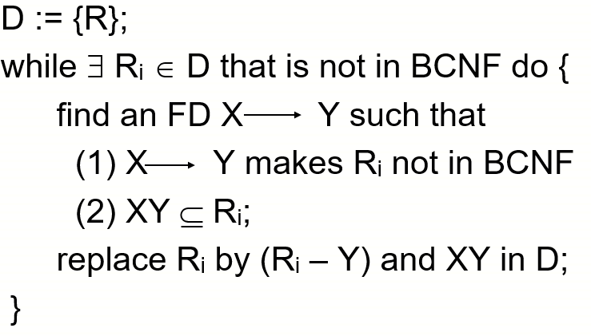

# Normalization

## First Normal Form

### 定义

* **No multivalued attributes** 不存在多值属性，也就是每个属性只能拥有一列值
* **Every attribute value is atomic** 属性的原子性，即属性**不可再分**

## Second Normal Form

### 定义

* **满足1NF**
* **每一个非主属性都`完全依赖`于任何一个候选码（主码）**

### 必要性

#### 对于S-L-C表

**S-L-C(Sno,Sdept,Sloc,Cno,Grade)**

* Sloc是学生住所

函数依赖关系(仅列出完全函数依赖关系)

* (Sno,Cno) -> Grade
* Sno -> Sdept
* Sno -> Sloc
* Sdept -> Sloc

**该表主码为(Sno,Cno),上述依赖关系表明，该表不属于2NF**

#### 产生问题

* **插入异常**
  * 插入新学生，但是未选课，插入失败。因为插入必须给定码值（缺Cno）
* **删除异常**
  * 删除选课信息会导致其他信息的丢失
* **修改复杂**
  * 如果一个学生选了多门课，则`(Sdept,Sloc)`被多次存储，如果学生转系，需要修改全部的`(Sdept,Sloc)`,造成修改的复杂化

#### 产生问题原因

**存在两类非主属性**

1. 如`Grade`，对码**完全函数依赖**
2. 如`Sdept` `Sloc`，对码**不是**完全函数依赖

#### 解决方法

> 按**2NF**定义，使得非主属性对主码完全函数依赖

##### 拆分S-L-C

**SC表：**  **(Sno,Cno,Grade)**

**S-D-L表：** **(Sno,Sdept,Sloc)**

## Third Normal Form

### 定义

* **满足2NF**
* **对于码X，属性组Y及非主属性Z，X->Y, Y->Z (Y !->X, Z不是Y的子集) 不成立**
  * 即每个非主属性都不传递依赖于R的候选键 

### 对于上述拆分满足2NF的表

#### SC表

> 没有传递函数依赖，满足**3NF**

#### S-D-L

由于`Sno->Sdept` ，`Sdept->Sloc`，`Sno->Sloc`，即`Sloc`传递依赖于`Sno`，不满足**3NF**

##### 解决

**S-D表：** **(Sno,Sdept)**

**D-L表：** **(Sdept,Sloc)**

## BCNF

### 定义

* **满足1NF**，按理说是在**3NF**之上
* **所有的决定因素都是超码**

### 性质（三个完全依赖）

* 所有的非主属性都完全依赖于每个候选码 **（候选码 -> 非主属性）**
* 所有主属性都完全依赖于每个不包含它的候选码（待理解）
* 没有任何属性完全依赖于非码的任何一组属性 

**高度规范化，消除插入和删除异常**

### 对于关系模式STJ

#### STJ(S,T,J)

* S表示学生，T表示教师，J表示课程
* 存在 `(S,J)->T` `(S,T)->J` `T-J` 

#### 范式判断

##### 1NF

* 无多值属性

##### 2NF

* 候选码`(S,J)` `(S,T)`决定任何非主属性

##### 3NF

* 不存在非主属性完全函数依赖于候选码

#### BCNF

* **T是决定因素，但T不包含码**

## Normalization to BCNF 

### LLJB-BCNF

#### Input

A relation schema R, a set of FDs in R

#### Ouput

A **lossless-join decomposition D** such that each new schema in D is in BCNF.

> 获得具有无损分解形式的多张表

#### EXE

#### 理解

**找出使得Ri不满足BCNF的函数依赖`X->Y`，将Ri分解为`Ri-Y`和`XY`，放入D**

