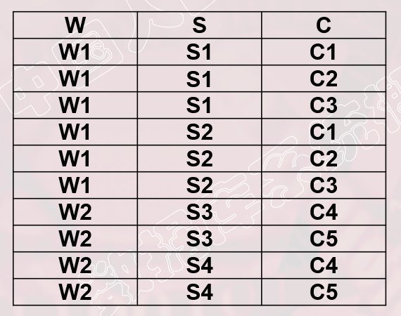
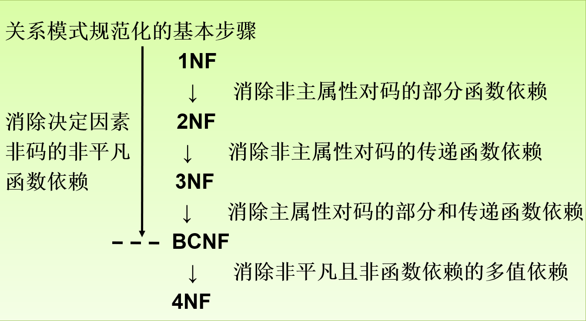

# Normalization

## First Normal Form

### 定义

* **No multivalued attributes** 不存在多值属性，也就是每个属性只能拥有一列值
* **Every attribute value is atomic** 属性的原子性，即属性**不可再分**

## Second Normal Form

### 定义

* **满足1NF**
* **每一个非主属性都`完全依赖`于任何一个候选码（主码）**

### 必要性

#### 对于S-L-C表

**S-L-C(Sno,Sdept,Sloc,Cno,Grade)**

* Sloc是学生住所

函数依赖关系(仅列出完全函数依赖关系)

* (Sno,Cno) -> Grade
* Sno -> Sdept
* Sno -> Sloc
* Sdept -> Sloc

**该表主码为(Sno,Cno),上述依赖关系表明，该表不属于2NF**

#### 产生问题

* **插入异常**
  * 插入新学生，但是未选课，插入失败。因为插入必须给定码值（缺Cno）
* **删除异常**
  * 删除选课信息会导致其他信息的丢失
* **修改复杂**
  * 如果一个学生选了多门课，则`(Sdept,Sloc)`被多次存储，如果学生转系，需要修改全部的`(Sdept,Sloc)`,造成修改的复杂化

#### 产生问题原因

**存在两类非主属性**

1. 如`Grade`，对码**完全函数依赖**
2. 如`Sdept` `Sloc`，对码**不是**完全函数依赖

#### 解决方法

> 按**2NF**定义，使得非主属性对主码完全函数依赖

##### 拆分S-L-C

**SC表：**  **(Sno,Cno,Grade)**

**S-D-L表：** **(Sno,Sdept,Sloc)**

## Third Normal Form

### 定义

* **满足2NF**
* **对于码X，属性组Y及非主属性Z，X->Y, Y->Z (Y !->X, Z不是Y的子集) 不成立**
  * 即每个非主属性都不传递依赖于R的候选键 
  * **不包含在任何一个候选码中的属性称为非主属性**

### 对于上述拆分满足2NF的表

#### SC表

> 没有传递函数依赖，满足**3NF**

#### S-D-L

由于`Sno->Sdept` ，`Sdept->Sloc`，`Sno->Sloc`，即`Sloc`传递依赖于`Sno`，不满足**3NF**

##### 解决

**S-D表：** **(Sno,Sdept)**

**D-L表：** **(Sdept,Sloc)**

### LLJB-DPD-3NF

* Find all candidate keys.
* Compute Fmin. 
* 对`Fmin`中的函数依赖关系`X->Ai`按**具有相同左值X**进行分类，创建`{X, A1, A2,..A3}`关系模式（保证该关系模式不存在于其他已创建的模式模式）
* 如果没有关系模式包含候选码，则候选码单独建立一个关系模式

#### Example

##### Given

R(Instructor, Class_no, Classroom, Text)

F = {Class_no->Classroom, Text}

##### 得到候选码

`Instructor(导师)` `Class_no`

##### 获取Fmin

Fmin = {Class_no->Classroom, Class_no->Text}

##### 对Fmin按左值进行分类建关系模式

{Class_no,Classroom,Text}

##### 候选码不包含在任何关系模式中，单独建立

{Instructor,Class_no}

##### 最后结果

D = {Class_no Classroom Text, Instructor Class_no}

## BCNF

### 定义

* **满足1NF**，按理说是在**3NF**之上
* **所有的决定因素都是超码**

### 性质（三个完全依赖）

* 所有的非主属性都完全依赖于每个候选码 **（候选码 -> 非主属性）**
* 所有主属性都完全依赖于每个不包含它的候选码（待理解）
* 没有任何属性完全依赖于非码的任何一组属性 

**高度规范化，消除插入和删除异常**

**任何只有`两个`属性的关系模式都满足BCNF**

### 对于关系模式STJ

#### STJ(S,T,J)

* S表示学生，T表示教师，J表示课程
* 存在 `(S,J)->T` `(S,T)->J` `T-J` 

#### 范式判断

##### 1NF

* 无多值属性

##### 2NF

* 候选码`(S,J)` `(S,T)`决定任何非主属性

##### 3NF

* 不存在非主属性完全函数依赖于候选码

#### BCNF

* **T是决定因素，但T不包含码**

## Normalization to BCNF 

### LLJB-BCNF

#### Input

A relation schema R, a set of FDs in R

#### Ouput

A **lossless-join decomposition D** such that each new schema in D is in BCNF.

> 获得具有无损分解形式的多张表

#### EXE

#### 理解

**找出使得Ri不满足BCNF的函数依赖`X->Y`，将Ri分解为`Ri-Y`和`XY`，放入D**

## Minimal Cover

### Definition

* `Fmin` 是`F`的一个覆盖

* `Fmin`中的每个函数依赖的右边都只有单一属性
* `Fmin`中不存在`多余(redudant)`的函数依赖
  * `X ->Y`是多余的：`F-{X->Y} = F` 
    * 也就是去除这个函数依赖后对F没有影响
* `Fmin`中不存在`无关extraneous`的函数依赖
  * `X->Y`是无关的：`(X-{A})->Y`能取代`X->Y`

### Example

#### Given F

F = {`A->BC`, `B->C`, `A-B`, `AB->C`} 

#### 拆分成右边只有单一属性状态

F = {`A->B`,`A-C`, `B->C`, `A-B`, `AB->C`}

#### 去除将多余状态

多余状态有：

* `A->B`

* `A->C`：可通过`A-B`和`B->C`传递而得

#### 去除无关状态

无关状态有

* `AB->C` :无论是去掉A还是B，都能被取代

#### 最后结果

Fmin = {`A->B`,`B->C`}

##  多值依赖

### 定义

* 设R(U)是属性集U上的一个关系模式

* X,Y,Z是U的子集，并且Z=`U-X-Y`。
* 关系模式R(U)中多值依赖`X→→Y`成立，当且仅当对R(U)的任一关系r，给定的一对(x,z)值，**有一组Y的值，这组值仅仅决定于x值而与z值无关**

意思就是存在`(x,z)`可确定多个`y`值，并且`x+y+z = u`

### 平凡多值依赖和非平凡的多值依赖

若 `X→→Y`，而`Z  = Ф` ，则称为平凡的多值依赖，否则是非平凡多值依赖 

### 实例

#### CTB表

* `C + T + B = U`，并且CT确定多个B

## 4NF

### 定义

关系模式R<U,F>∈1NF，如果对于R的每个**非平凡多值依赖X→→Y（Y ⊈ X）(存在Z值)**，X都含有码，则R<U,F>∈4NF

#### 理解

4NF就是限制关系模式的属性之间**不允许有非平凡且非函数依赖的多值依赖**。4NF**所允许的非平凡多值依赖实际上是函数依赖**

### Example

#### WSC

* W表示仓库，S 表示保管员，C 表示商品。

* 假设每个仓库有若干个保管员，有若干种商品。
* 每个保管员保管所在仓库的所有商品，每种商品被所有保管员保管

#### 解题

* `W → → S` 并且C不为空，所以是非平凡多值依赖 
* ` W → → C`  同理，是非平凡多值依赖

按**4NF**要求，W必须含有码，而WSC的码是`(W,S,C)` ，所以不满足4NF

可以把WSC分解成WS(W,S),WC(W,C)， WS∈4NF，WC∈4NF。

## 总结

