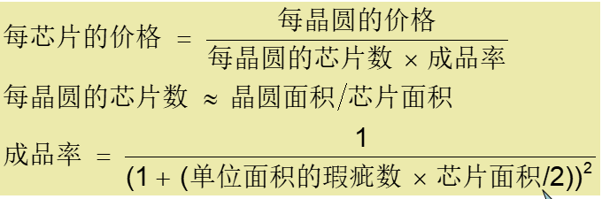

## 1
> p36 1.1 1.2

### **1.1** 列举和描述除智能手机之外的四种类型的计算机
* `个人计算机(Personal computers)`  
    * 个人使用的计算机，具有通用、多样化的软件支持
    * 可以提供良好的性能，低廉的价格
* `服务器(Server computers)`
    * 是支持多用户并行使用，一般用于运行大程序的基于网络访问的巨型计算机
    * 具有大容量、高性能和可靠性，功能和价格从低端到高端伸缩范围大
* `超级计算机(Super computers)`
    * 用于高端科学和工程计算
    * 代表了最高的计算能力，占市场比例小
* `嵌入式计算机(Embedded computer)`
    * 嵌入到其他设备的计算机，一般运行预定义的一个或者一组应用程序
    * 隐藏作为系统的组件，功耗、成本和性能受限
* `个人移动设备（PMD，包括平板电脑）`
    * PMD通过无线连接到互联网进行电池供电，通常需要花费数百美元，而且，与PC一样，用户可以下载软件（“应用程序”）来运行它们。 
    * 与PC不同，它们不再具有键盘和鼠标，并且更可能依赖于触敏屏幕甚至语音输入。
* `仓库规模计算机(Warehouse scale computer)`
    * 成千上万的处理器形成一个大型集群
    
### **1.2** 八大思想套用到其他领域
* a.汽车制造中的组装生产线：<u>利用流水线提高性能</u>
* b.吊桥缆索：<u>通过冗余提高可靠性</u>
    * 附加各种安全设施提高安全性
* c.采用风向信息的飞机和船舶导航：<u>采用预测提高性能</u>
* d.高楼的高速电梯：<u>加速大概率事件</u>
    * 发生坐电梯的概率很大，于是通过提升电梯速度，提高运载效率
* e.图书馆的预定台：<u>存储层次</u>
    * 
不懂

* f.通过增大CMOS晶体管的...减小翻转事件：<u>采用并行提升效率</u>
    * 一定时间内让更多的..通过
* g.增加电磁飞机弹射弹...允许有新型反应堆技术才能产生更多能量：<u>摩尔设计定律</u>
    * 在设计过程中预留空间，为快速的技术迭代提供支持
* h.制造自动驾驶汽车，控制系统是安装在....传感器系统...：<u>使用抽象简化设计</u>
    * 
不理解...

 

## 2
> p37 1.0

1 晶圆直径：15cm，成本：12，芯片数：84，缺陷系数：0.02 cm^2

2 .......:20cm，....：15，.....：100,........:0.031

### 1.10.1 求每种芯片的成品率

res1 = 0.9593

res2 = 0.9093
 
### 1.10.2 求每种芯片的价格
借用公式1

res1 = 12/(84*0.9593) = 0.1489

res2 = 15/(100*0.9093) = 0.1650

### 1.10.3 每晶圆芯片数量增加10%，每单位面积的瑕疵数增加15%，求芯片面积和成品率

area1 = pi*(7.5)^2/(84*1.1) = 1.91

area2 = pi*(10)^2/(100*1.1) = 2.86

p1 = 1/(1+(c1*area1/2))^2 = 0.9575

p2 = 1/(1+(c2*area2/2))^2 = 0.9082

 
