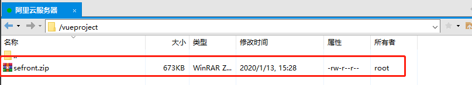
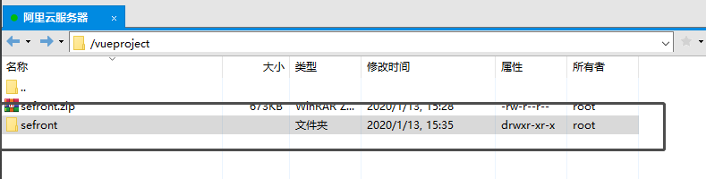
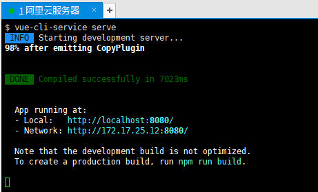

# Node.js 部署Vue项目

* [Node\.js 部署Vue项目](#nodejs-%E9%83%A8%E7%BD%B2vue%E9%A1%B9%E7%9B%AE)
  * [打包](#%E6%89%93%E5%8C%85)
  * [运行](#%E8%BF%90%E8%A1%8C)
    * [解压缩](#%E8%A7%A3%E5%8E%8B%E7%BC%A9)
    * [Node\.js 部署](#nodejs-%E9%83%A8%E7%BD%B2)
      * [装载依赖](#%E8%A3%85%E8%BD%BD%E4%BE%9D%E8%B5%96)
    * [运行](#%E8%BF%90%E8%A1%8C-1)
      * [报错](#%E6%8A%A5%E9%94%99)
      * [yarn 安装](#yarn-%E5%AE%89%E8%A3%85)
      * [使用yarn运行工程](#%E4%BD%BF%E7%94%A8yarn%E8%BF%90%E8%A1%8C%E5%B7%A5%E7%A8%8B)
        * [检查端口](#%E6%A3%80%E6%9F%A5%E7%AB%AF%E5%8F%A3)
        * [运行](#%E8%BF%90%E8%A1%8C-2)

---

## 打包


将本地Vue工程打包为压缩文件

* 不要打包目录下的`node_modules`


复制到Linux服务器下



---


## 运行


### 解压缩

小问题

> unzip: command not found

安装`zip`和`unzip`

```shell
yum install -y zip unzip
```


解压已打包的工程文件

> 解压到指定文件中

```shell
unzip -d /vueproject/sefront sefront.zip
```




### Node.js 部署


#### 装载依赖

```shell
cnpm install
```


### 运行


#### 报错

```shell
npm run serve
```

此时**yarn大法好**


#### yarn 安装

* 安装文档 ： [https://yarn.bootcss.com/docs/install/#centos-stable](https://yarn.bootcss.com/docs/install/#centos-stable)

On CentOS, Fedora and RHEL, you can install Yarn via our RPM package repository.

```shell
curl --silent --location https://dl.yarnpkg.com/rpm/yarn.repo | sudo tee /etc/yum.repos.d/yarn.repo
```

Then you can simply:

```shell
sudo yum install yarn
```

通过如下命令测试 Yarn 是否安装成功：

```shell
yarn --version
```


#### 使用yarn运行工程


##### 检查端口

yarn 默认使用`8080`端口，如果`8080`端口被占用，会按顺序选择后续端口发布

检查预发布端口是否占用

```shell
netstat -tunlp | grep 8080
```

出现下列情况表示占用

* `tcp	0  0 0.0.0.0:8080   0.0.0.0:*   LISTEN      26993/nodejs `

`26993`是进程号

杀掉进程，释放该端口

```shell
kill -9 26993
```


**！记得在服务器控制台的防火墙那开启8080端口的访问**


##### 运行

```shell
yarn serve
```




---

完结，撒花~