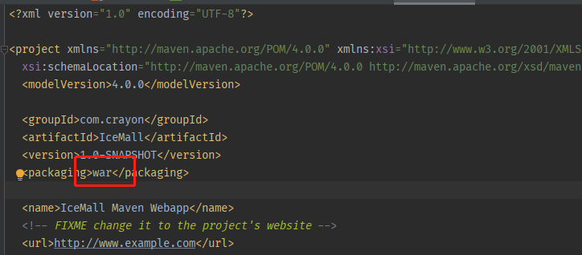
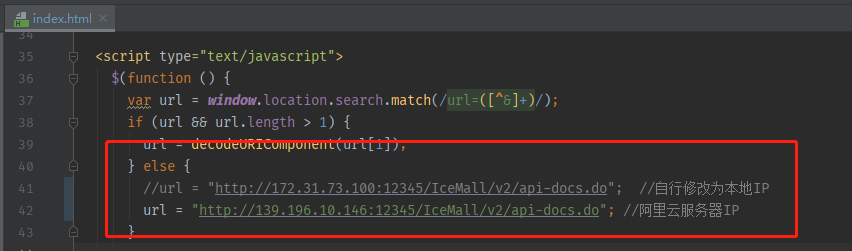
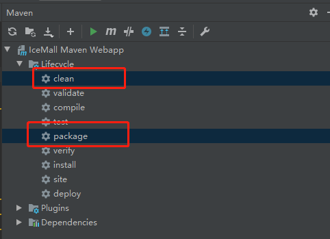
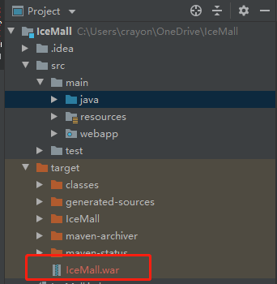
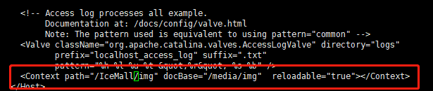
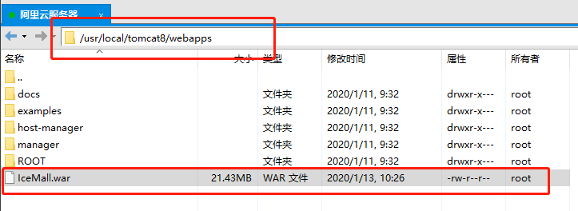

# 部署SSM项目到阿里云服务器

* [部署SSM项目到阿里云服务器](#%E9%83%A8%E7%BD%B2ssm%E9%A1%B9%E7%9B%AE%E5%88%B0%E9%98%BF%E9%87%8C%E4%BA%91%E6%9C%8D%E5%8A%A1%E5%99%A8)
  * [Maven生成war包](#maven%E7%94%9F%E6%88%90war%E5%8C%85)
    * [检查pom\.xml](#%E6%A3%80%E6%9F%A5pomxml)
    * [修改项目部分路径\-针对IceMall](#%E4%BF%AE%E6%94%B9%E9%A1%B9%E7%9B%AE%E9%83%A8%E5%88%86%E8%B7%AF%E5%BE%84-%E9%92%88%E5%AF%B9icemall)
      * [图片存储位置](#%E5%9B%BE%E7%89%87%E5%AD%98%E5%82%A8%E4%BD%8D%E7%BD%AE)
      * [swagger API文档访问路径](#swagger-api%E6%96%87%E6%A1%A3%E8%AE%BF%E9%97%AE%E8%B7%AF%E5%BE%84)
    * [打包成war包](#%E6%89%93%E5%8C%85%E6%88%90war%E5%8C%85)
  * [服务器Tomcat配置](#%E6%9C%8D%E5%8A%A1%E5%99%A8tomcat%E9%85%8D%E7%BD%AE)
    * [图片访问路径](#%E5%9B%BE%E7%89%87%E8%AE%BF%E9%97%AE%E8%B7%AF%E5%BE%84)
  * [启动服务器](#%E5%90%AF%E5%8A%A8%E6%9C%8D%E5%8A%A1%E5%99%A8)
    * [导入war包](#%E5%AF%BC%E5%85%A5war%E5%8C%85)
    * [启动tomcat](#%E5%90%AF%E5%8A%A8tomcat)
      * [查看进程信息](#%E6%9F%A5%E7%9C%8B%E8%BF%9B%E7%A8%8B%E4%BF%A1%E6%81%AF)
      * [实时查看日志](#%E5%AE%9E%E6%97%B6%E6%9F%A5%E7%9C%8B%E6%97%A5%E5%BF%97)

---

## Maven生成war包

### 检查`pom.xml`

检查打包格式，确保导出格式是`war`包




### 修改项目部分路径-针对IceMall


#### 图片存储位置

> 历史遗留原因，图片存储在本地，所以需要修改为Linux下路径

系统常量接口路径

* `com.crayon.setting.constant.SystemConstant`


#### swagger API文档访问路径

> 修改文档访问位置，主要是由于运行IP改变

swagger文档页面位置

* `webapps/swagger/index.html`

切换为阿里云服务器下的url访问位置




### 打包成war包

双击`clean`清除无效文件（例如`target`）

双击`package`打包



生成的war包位于编译后的目标目录下，对于IceMall项目，位于`target`目录




## 服务器Tomcat配置

### 图片访问路径

在项目准备时，曾将访问路径设置为`/img`，但考虑到后面有可能一个Tomcat部署多个项目，于是修改为`/IceMall/img`




## 启动服务器

### 导入war包

将war包上传到tomcat的`webapps`目录下




### 启动tomcat

执行如下命令

```shell
cd /usr/local/tomcat8/bin
./startup.sh
```

#### 查看进程信息

```shell
ps -ef|grep java
```

```text
root      6382     1 76 10:28 pts/0    00:00:15 /usr/bin/java -Djava.util.logging.config.file=/usr/local/tomcat8/conf/logging.properties -Djava.util.logging.manager=org.apache.juli.ClassLoaderLogManager -Djdk.tls.ephemeralDHKeySize=2048 -Djava.protocol.handler.pkgs=org.apache.catalina.webresources -Djava.security.egd=file:/dev/urandom -Dorg.apache.catalina.security.SecurityListener.UMASK=0027 -Dignore.endorsed.dirs= -classpath /usr/local/tomcat8/bin/bootstrap.jar:/usr/local/tomcat8/bin/tomcat-juli.jar -Dcatalina.base=/usr/local/tomcat8 -Dcatalina.home=/usr/local/tomcat8 -Djava.io.tmpdir=/usr/local/tomcat8/temp org.apache.catalina.startup.Bootstrap start
```

查看运行状态

```shell
sudo netstat -apn | grep 6382
```

```text
tcp        0      0 0.0.0.0:8009            0.0.0.0:*               LISTEN      6382/java 
tcp        0      0 0.0.0.0:12345           0.0.0.0:*               LISTEN      6382/java 
tcp        0      0 127.0.0.1:8005          0.0.0.0:*               LISTEN      6382/java
tcp        0      0 172.17.25.12:50730      139.196.10.146:3306     ESTABLISHED 6382/jav 
unix  2      [ ]         STREAM     CONNECTED     553635   6382/java
```

项目运行正常


#### 实时查看日志

```shell
cd /usr/local/tomcat8/logs
tail -f catalina.out
```


