# 部署项目准备

* [部署项目准备](#%E9%83%A8%E7%BD%B2%E9%A1%B9%E7%9B%AE%E5%87%86%E5%A4%87)
  * [基础环境搭建](#%E5%9F%BA%E7%A1%80%E7%8E%AF%E5%A2%83%E6%90%AD%E5%BB%BA)
    * [下载Xshell &amp; Xftp6](#%E4%B8%8B%E8%BD%BDxshell--xftp6)
      * [Xshell连接服务器](#xshell%E8%BF%9E%E6%8E%A5%E6%9C%8D%E5%8A%A1%E5%99%A8)
      * [Xftp6连接服务器](#xftp6%E8%BF%9E%E6%8E%A5%E6%9C%8D%E5%8A%A1%E5%99%A8)
    * [安装SSM项目必要环境](#%E5%AE%89%E8%A3%85ssm%E9%A1%B9%E7%9B%AE%E5%BF%85%E8%A6%81%E7%8E%AF%E5%A2%83)
      * [安装jdk](#%E5%AE%89%E8%A3%85jdk)
        * [查询jdk版本](#%E6%9F%A5%E8%AF%A2jdk%E7%89%88%E6%9C%AC)
      * [安装MySQL](#%E5%AE%89%E8%A3%85mysql)
    * [安装Tomcat](#%E5%AE%89%E8%A3%85tomcat)
      * [更多操作](#%E6%9B%B4%E5%A4%9A%E6%93%8D%E4%BD%9C)
        * [修改Tomcat默认端口号](#%E4%BF%AE%E6%94%B9tomcat%E9%BB%98%E8%AE%A4%E7%AB%AF%E5%8F%A3%E5%8F%B7)
        * [关闭Tomcat](#%E5%85%B3%E9%97%ADtomcat)
        * [查看Tomcat状态](#%E6%9F%A5%E7%9C%8Btomcat%E7%8A%B6%E6%80%81)
    * [配置Node\.js环境](#%E9%85%8D%E7%BD%AEnodejs%E7%8E%AF%E5%A2%83)
      * [使用淘宝npm镜像](#%E4%BD%BF%E7%94%A8%E6%B7%98%E5%AE%9Dnpm%E9%95%9C%E5%83%8F)
        * [使用cpnm命令安装模块](#%E4%BD%BF%E7%94%A8cpnm%E5%91%BD%E4%BB%A4%E5%AE%89%E8%A3%85%E6%A8%A1%E5%9D%97)
      * [安装vue\-cli](#%E5%AE%89%E8%A3%85vue-cli)
  * [MySQL操作](#mysql%E6%93%8D%E4%BD%9C)
    * [本地数据库导出Sql](#%E6%9C%AC%E5%9C%B0%E6%95%B0%E6%8D%AE%E5%BA%93%E5%AF%BC%E5%87%BAsql)
      * [使用mysqldump](#%E4%BD%BF%E7%94%A8mysqldump)
      * [服务器导入Sql](#%E6%9C%8D%E5%8A%A1%E5%99%A8%E5%AF%BC%E5%85%A5sql)
    * [IDEA远程连接数据库](#idea%E8%BF%9C%E7%A8%8B%E8%BF%9E%E6%8E%A5%E6%95%B0%E6%8D%AE%E5%BA%93)
      * [服务器端开启3306端口访问](#%E6%9C%8D%E5%8A%A1%E5%99%A8%E7%AB%AF%E5%BC%80%E5%90%AF3306%E7%AB%AF%E5%8F%A3%E8%AE%BF%E9%97%AE)
      * [远程连接报错解决](#%E8%BF%9C%E7%A8%8B%E8%BF%9E%E6%8E%A5%E6%8A%A5%E9%94%99%E8%A7%A3%E5%86%B3)
      * [连接数据库](#%E8%BF%9E%E6%8E%A5%E6%95%B0%E6%8D%AE%E5%BA%93)
    * [SSM项目更改数据源](#ssm%E9%A1%B9%E7%9B%AE%E6%9B%B4%E6%94%B9%E6%95%B0%E6%8D%AE%E6%BA%90)
  * [Tomcat 操作](#tomcat-%E6%93%8D%E4%BD%9C)
    * [访问本地图片](#%E8%AE%BF%E9%97%AE%E6%9C%AC%E5%9C%B0%E5%9B%BE%E7%89%87)
    * [初启动Tomcat加速](#%E5%88%9D%E5%90%AF%E5%8A%A8tomcat%E5%8A%A0%E9%80%9F)

---

## 基础环境搭建

### 下载Xshell & Xftp6

Xshell用于连接服务器

Xftp6用于文件传输

**下载地址**

* https://www.netsarang.com/zh/all-downloads/?code=623

#### Xshell连接服务器

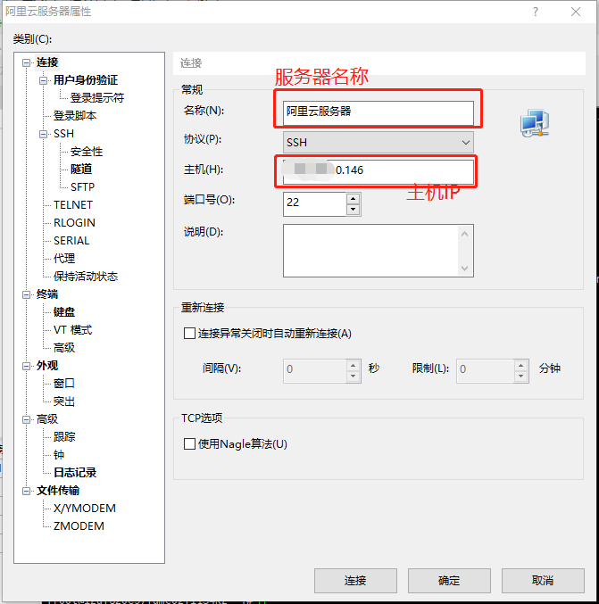


#### Xftp6连接服务器

> 与Xshell连接类似


### 安装SSM项目必要环境

#### 安装jdk

```shell
yum -y install java-1.8.0-openjdk.x86_64
```

##### 查询jdk版本

```shell
java -version
```


#### 安装MySQL

```shell
cd /tmp
wget http://repo.mysql.com/mysql-community-release-el7-5.noarch.rpm  
rpm -ivh mysql-community-release-el7-5.noarch.rpm  
```

执行

```shell
yum install mysql mysql-server mysql-devel -y
```

启动MySQL

```shell
systemctl start mysql.service
```


**进入MySQL命令**

> 一开始没有密码，直接`mysql`即可进入`mysql`命令行


**设置MySQL密码**

```shell
set password = password('root');
```


**带密码进入MySQL命令行**

```shell
mysql -u root -p****
```

`root` 用户名

`****` 密码


### 安装Tomcat

下载地址

* [https://mirrors.tuna.tsinghua.edu.cn/apache/tomcat/](https://mirrors.tuna.tsinghua.edu.cn/apache/tomcat/)

选择版本

* `/tomcat-8/v8.5.50/bin/` 
* 选择该目录下的 `apache-tomcat-8.5.50.tar.gz `


将压缩文件通过**Xftp**放入`/usr/local`目录下

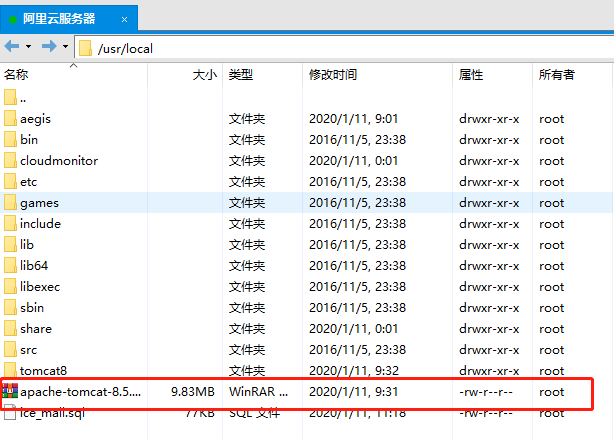

解压并将文件名修改为`tomcat8`

```shell
tar xzf apache-tomcat-8.5.50.tar.gz
```


启动tomcat

```shell
 cd /usr/local/tomcat8/bin
./startup.sh
```


**打开阿里云管理控制台，设置安全组**

> 此步骤避免安全拦截

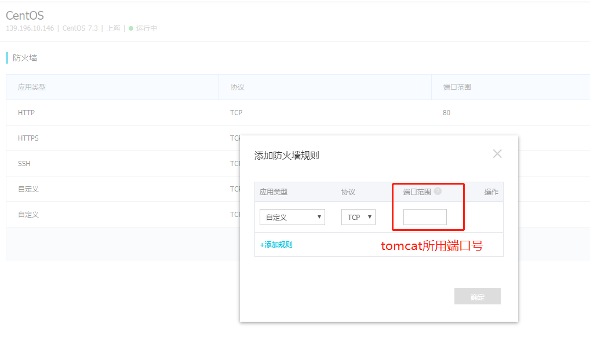

测试打开

> 运行Tomcat后第一次打开页面**等待时间较长**

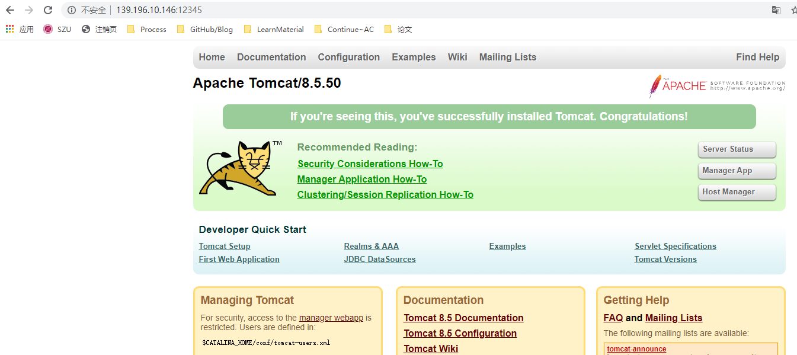


#### 更多操作


##### 修改Tomcat默认端口号

进入`/usr/local/tomcat8/conf` 修改`server.xml`文件

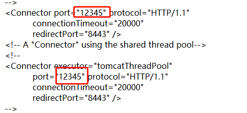

##### 关闭Tomcat

进入bin目录

```shell
cd /usr/local/tomcat8/bin
```

使用Tomcat关闭命令

```shell
./shutdown.sh
```


##### 查看Tomcat状态

运行进程查看

```shell
ps -ef|grep java
```

> 如果显示`root 19955 19757 0 17:48 pts/0 00:00:00 grep java`表示Tomcat已关闭


以下信息是运行状态，可以查看Tomcat进程，**红框部分是进程号**

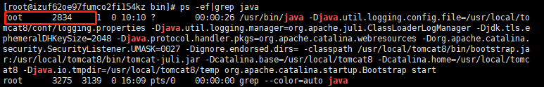


可以使用`kill`命令强制关闭Tomcat进程

```shell
 kill -9 2834
```


查看Tomcat运行端口

```shell
sudo netstat -apn | grep 2834
```

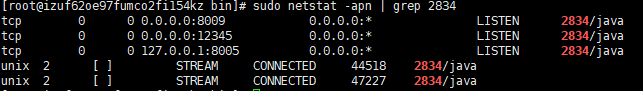


### 配置Node.js环境

下载地址

* [http://nodejs.cn/download/](http://nodejs.cn/download/)

下载`Linux二进制文件`

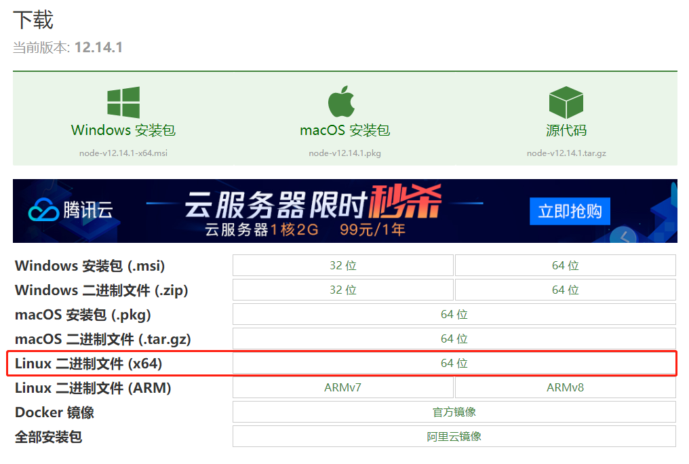

将压缩文件通过**Xftp**放入`/usr/local`目录下

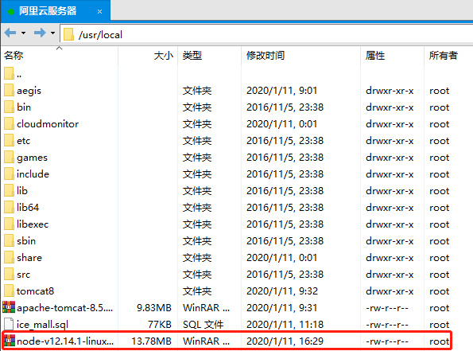


解压文件，并修改文件名为`nodejs12`

```shell
tar -xvf node-v12.14.1-linux-x64.tar.xz
```

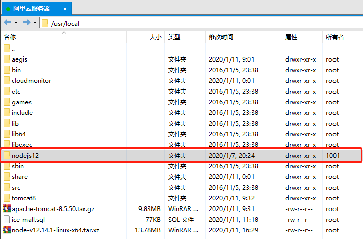


创建软链接，这样就可以在任意目录下直接使用node和npm命令

`/usr/local/nodejs12/bin/node` node环境地址

`/usr/local/bin/node` 链接位置

```shell
ln -s /usr/local/nodejs12/bin/node /usr/local/bin/node
ln -s /usr/local/nodejs12/bin/npm /usr/local/bin/npm
```


查看版本信息 

> 如果软链接配置成功，可以看到版本信息

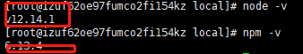


#### 使用淘宝npm镜像

```shell
npm install -g cnpm --registry=https://registry.npm.taobao.org
```

##### 使用cpnm命令安装模块

```shell
cnpm install [name]
```

创建软链接

```shell
ln -s /usr/local/nodejs12/bin/cnpm /usr/local/bin/cnpm
```


#### 安装vue-cli


用cnpm下载`vue-cli`

```shell
cnpm install -g vue-cli
```

创建软链接

```shell
ln -s /usr/local/nodejs12/bin/vue /usr/local/bin/vue
```

创建成功时，可以查看到版本信息

```shell
vue -V
```


## MySQL操作

### 本地数据库导出Sql

#### 使用`mysqldump`

导出ice_mall数据库为ice_mall.sql

```shell
mysqldump -u root -p ice_mall > E:/ice_mall.sql
```


#### 服务器导入Sql

将导出的sql复制到服务器下目录

启动mysql，创建名为**ice_mall**的数据库

```shell
mysql -u root -p****
create database ice_mall default character set utf-8
```


导入`ice_mall.sql`

```shell
ice_mall < /usr/local/ice_mall.sql
```


### IDEA远程连接数据库


#### 服务器端开启`3306`端口访问

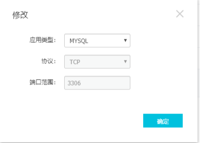

#### 远程连接报错解决

> Host * is not allowed to connect to this MySQL server

将localhost改成%

```mysql
use mysql
update user set host = '%'
where user = 'root' and host = 'localhost'
flush privileges;   # 刷新
```


#### 连接数据库

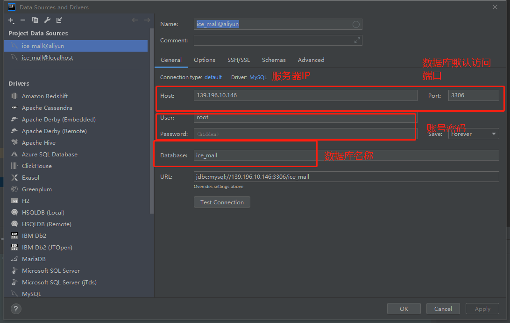


**解决无法查看数据库表的问题**

在设置页，选择`Schemas` ,勾选`ice_mall`

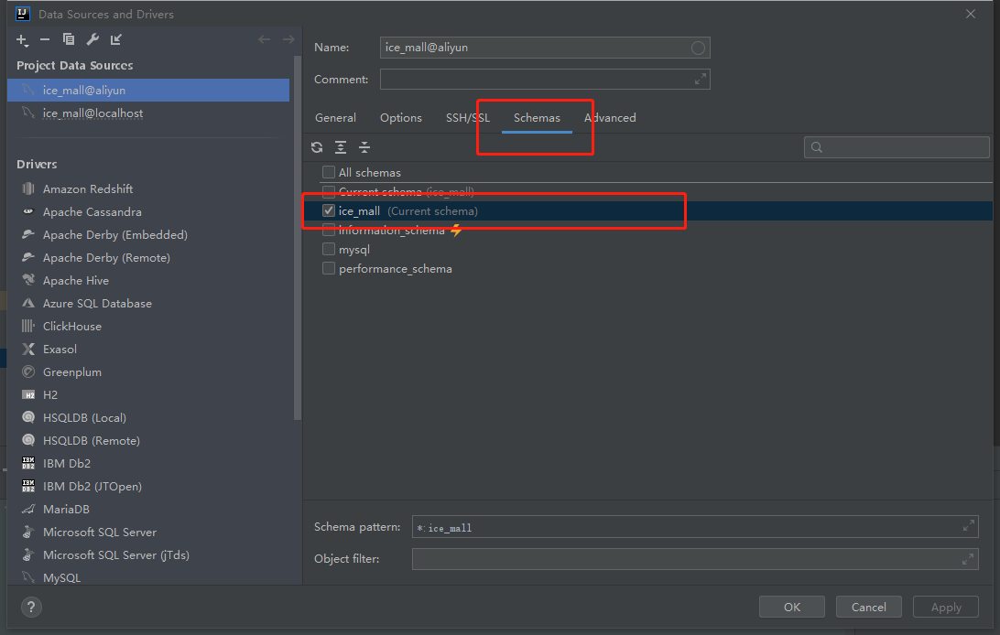


### SSM项目更改数据源

修改为阿里云服务器的MySQL数据源

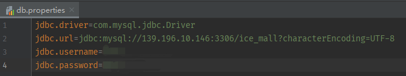


## Tomcat 操作

### 访问本地图片

修改`/usr/local/tomcat8/conf`目录下的`server.xml`文件

在`Host`标签下，增加`<Context path="/img" docBase="/media/img"  reloadable="true"></Context>`

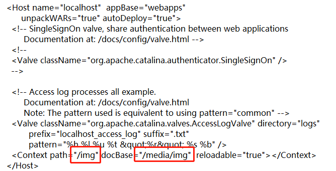


**参数说明**

* `path` 映射路径，也就是浏览器上访问图片的相对路径
  * 如上，就是 `服务器ip:12345(tomcat服务端口号)/img`
* `docBase` 本地文件地址


### 初启动Tomcat加速


修改`/usr/local/tomcat8/bin`目录下的`catalina.sh`文件

在该位置添加 `-Djava.security.egd=file:/dev/urandom`

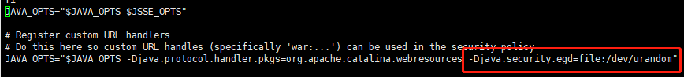


